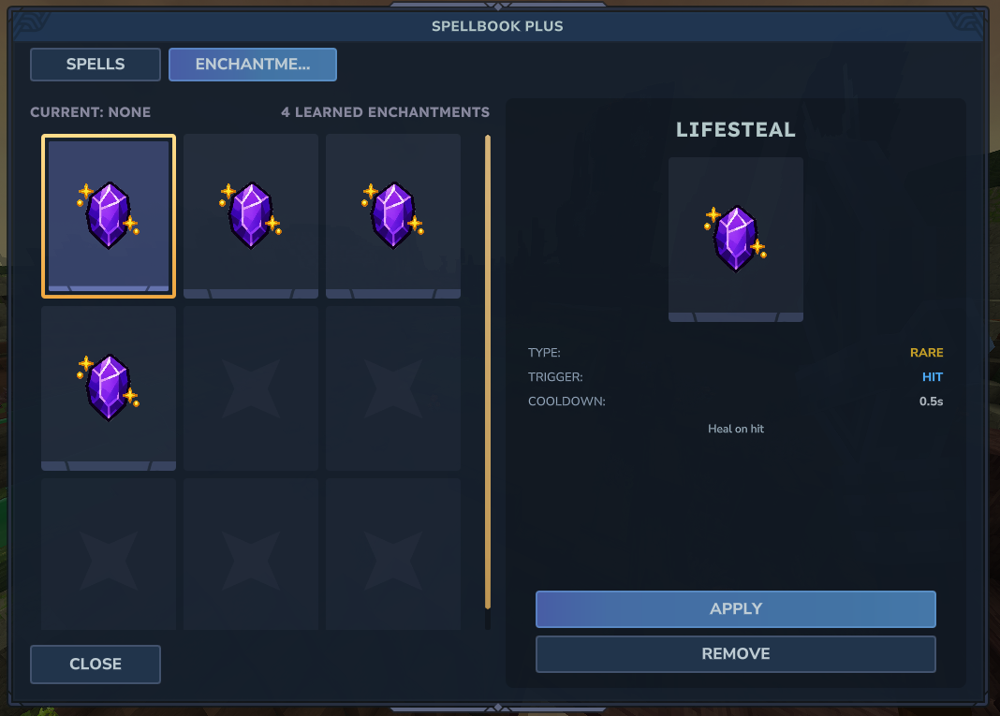
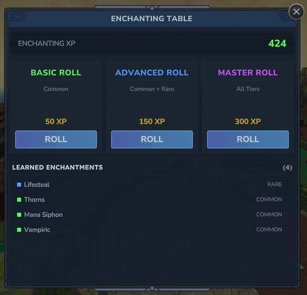

# Enchantments

Enchantments are trigger-based effects that attach to staffs and fire automatically during combat. Each enchantment uses the same node-graph system as spells.



## How Enchantments Work

1. Players earn enchanting XP by hitting and killing enemies with spells
2. XP is spent at the Enchanting Table UI to roll for random enchantments
3. Enchantments are applied to the player's staff
4. When the enchantment's trigger fires (e.g. `on_hit`), its node graph executes automatically

## Tiers

| Tier | Roll Cost | Description |
|------|-----------|-------------|
| Common | 50 XP | Basic enchantments |
| Rare | 150 XP | Intermediate enchantments |
| Epic | 300 XP | Powerful enchantments |

Roll costs are configurable in [Configuration](configuration.md).

## Triggers

Each enchantment has a trigger that determines when it activates:

| Trigger | Description |
|---------|-------------|
| `on_cast` | When a spell is cast |
| `on_hit` | When a spell projectile hits a target |
| `on_kill` | When the caster kills an enemy |
| `on_damage_taken` | When the caster takes damage |
| `on_heal` | When the caster is healed |
| `on_expire` | When a spell effect expires |
| `on_interval` | On a repeating timer |
| `on_enter_combat` | When entering combat |
| `on_exit_combat` | When leaving combat |

## Enchanting Table UI

Open the Enchanting Table UI with `/sb enchant` or by interacting with an Enchanting Table block.



The UI shows:

- Current enchanting XP
- Roll options per tier (Basic, Advanced, Master)
- Active enchantments on the current staff

## XP System

Enchanting XP is earned through staff spell combat only. Melee kills do not award XP.

| Action | XP Earned | Notes |
|--------|-----------|-------|
| Spell projectile hit | 2 (configurable) | Only if the target survives the hit |
| Spell kill | 5 (configurable) | Projectile, AOE, or direct spell damage kills |

If a single hit kills the target, only the kill XP is awarded (not both hit and kill). Set `xpPerHit` to `0` in [Configuration](configuration.md) to disable hit XP entirely.

## Stacking and Cooldowns

Each enchantment has:

- **maxStacks** — Maximum number of times the enchantment can stack (default: 1)
- **cooldown** — Cooldown between activations in seconds (default: 0)

## Enchantment JSON Format

Enchantment definitions are stored as JSON files in the `enchantments/` directory:

```json
{
  "id": "fire_burst",
  "name": "Fire Burst",
  "trigger": "on_hit",
  "maxStacks": 1,
  "cooldown": 2.0,
  "tier": "COMMON",
  "rollWeight": 100,
  "description": "Deals bonus fire damage on hit.",
  "graph": {
    "nodes": [
      {
        "id": "node_1",
        "type": "damage",
        "parameters": {
          "amount": 10
        },
        "connections": ["node_2"]
      },
      {
        "id": "node_2",
        "type": "particle",
        "parameters": {
          "particleId": "Spellbook_Fire_Cast"
        },
        "connections": []
      }
    ]
  }
}
```

### Fields

| Field | Type | Required | Description |
|-------|------|----------|-------------|
| `id` | string | Yes | Unique enchantment identifier |
| `name` | string | Yes | Display name |
| `trigger` | string | Yes | Trigger type (see Triggers table) |
| `maxStacks` | int | No | Max stacks (default: 1) |
| `cooldown` | float | No | Cooldown in seconds (default: 0) |
| `tier` | string | Yes | `COMMON`, `RARE`, or `EPIC` |
| `rollWeight` | int | No | Weight for random rolling (default: 100) |
| `description` | string | No | Description text |
| `graph` | object | Yes | Node graph (same format as spells) |

## Roll Weights

When rolling for enchantments, the system uses weighted random selection. Higher `rollWeight` values make an enchantment more likely to appear. All enchantments of the selected tier are included in the pool.

## Commands

```
/sb enchant                        # Open Enchanting Table UI
/sb enchantment add <id>           # Apply enchantment to staff
/sb enchantment remove <id>        # Remove enchantment from staff
/sb enchantment list               # List active enchantments
/sb enchantment available          # List all registered enchantments
```

## Creating Custom Enchantments

1. Create a new `.json` file in the `enchantments/` directory
2. Define the enchantment metadata (id, name, trigger, tier)
3. Build a node graph using the same node types as spells
4. Run `/sb reload` to load the new enchantment
