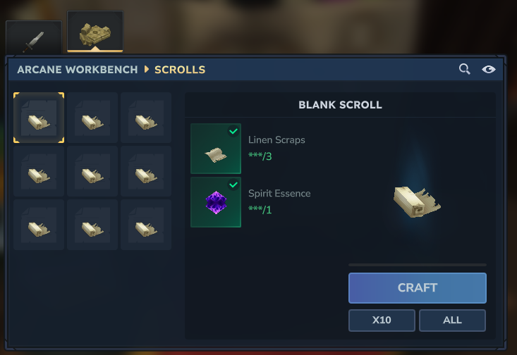

# Items

Spellbook Plus adds staffs, scrolls, materials, and crafting stations.

## Spell Staffs

Staffs are the primary way to cast spells. Each staff has a quality tier that affects performance. In v2, staffs are also **enchantable** — you can apply enchantments via the Enchanting Table UI or commands.

### Quality Tiers

| Quality | Color | Damage | Mana Cost | Cooldown |
|---------|-------|--------|-----------|----------|
| Common | White | +0% | +0% | +0% |
| Uncommon | Green | +10% | -5% | +0% |
| Rare | Blue | +20% | -10% | -10% |
| Epic | Purple | +35% | -15% | -20% |
| Legendary | Orange | +50% | -25% | -30% |

### Staff Types

Each spell has its own staff variant:

- Fireball Staff
- Frost Bolt Staff
- Arcane Bolt Staff
- Lightning Staff
- Healing Light Staff
- Force Push Staff
- Mana Shield Staff
- Blink Staff

### Crafting Staffs

Craft staffs at the Arcane Workbench.


**Common Staff Recipe:**
- Arcane Dust x2
- Wood Trunk x5

Higher quality staffs require additional materials.

### Enchanting Staffs

Staffs can receive enchantments that trigger automatically during combat. See [Enchantments](enchantments.md) for details on the enchantment system.

## Spell Scrolls

Scrolls allow players to permanently learn spells.

### Blank Scroll

A blank scroll that can be inscribed with a spell.



**Recipe:**
- Linen Fabric Scrap x3
- Spirit Essence x1

*Crafted at: Arcane Workbench*

### Spell Scrolls

Each spell has a corresponding scroll. All spell scrolls require a Blank Scroll plus additional materials:

| Scroll | Additional Materials |
|--------|---------------------|
| Force Push | Arcane Dust |
| Arcane Bolt | Arcane Dust x2 |
| Frost Bolt | Arcane Dust x2, Spirit Essence |
| Blink | Arcane Shard, Spirit Essence |
| Healing Light | Arcane Shard, Spirit Essence x2 |
| Fireball | Arcane Shard x2, Ember Heart |
| Mana Shield | Arcane Crystal, Spirit Essence x2 |
| Lightning | Arcane Crystal x2, Golem Core |

*Crafted at: Arcane Workbench*

### Using Scrolls

1. Obtain a spell scroll
2. Right-click to use
3. The spell is permanently learned
4. Access learned spells via the spell wheel

## Materials

Crafting materials for staffs and scrolls.

### Arcane Materials

| Material | Source | Rarity | Use |
|----------|--------|--------|-----|
| Arcane Dust | Void Larva, Void Crawler | Common | Basic recipes |
| Arcane Shard | Void Eye, Void Spawn | Uncommon | Intermediate recipes |
| Arcane Crystal | Void Spectre, Crystal Golems | Rare | Advanced recipes |

### Elemental Components

| Material | Source | Rarity | Use |
|----------|--------|--------|-----|
| Spirit Essence | Elemental Spirits (Root, Thunder, Frost) | Uncommon | Enchantments, scrolls |
| Ember Heart | Flame Crystal Golem | Epic | Epic upgrades |
| Golem Core | All Crystal Golems, Firesteel Golem | Legendary | Legendary upgrades |

### Drop Sources

Materials drop from NPCs via the programmatic drop table system. See [Drop Tables](drops.md) for full details, default drop rates, and how to add custom drops.

| Creature | Drops |
|----------|-------|
| Void Larva | Arcane Dust |
| Void Crawler | Arcane Dust |
| Void Eye | Arcane Dust, Arcane Shard |
| Void Spawn | Arcane Shard, Arcane Dust |
| Void Spectre | Arcane Crystal, Arcane Shard |
| Spirit Root / Thunder / Frost | Spirit Essence |
| Crystal Golems (Earth, Thunder, Frost, Sand) | Golem Core, Arcane Crystal |
| Crystal Golem Flame | Golem Core, Ember Heart, Arcane Crystal |
| Firesteel Golem | Golem Core, Arcane Crystal |

## Crafting Stations

### Arcane Workbench

A special crafting station for magical items.

**Recipe:**
- Wood Trunk x6
- Stone x4
- Arcane Dust x2

*Crafted at: Workbench*

**Crafts:**
- All staff types
- Spell scrolls
- Higher tier crystals

### Placing

1. Obtain an Arcane Workbench
2. Place it in the world
3. Right-click to open crafting interface

## Item Commands

Admins can give items directly:

```
/sb staff --spell fireball --quality rare
/sb scroll --spell healing_light
/sb material --material arcane_dust
/sb material --material arcane_workbench
```
