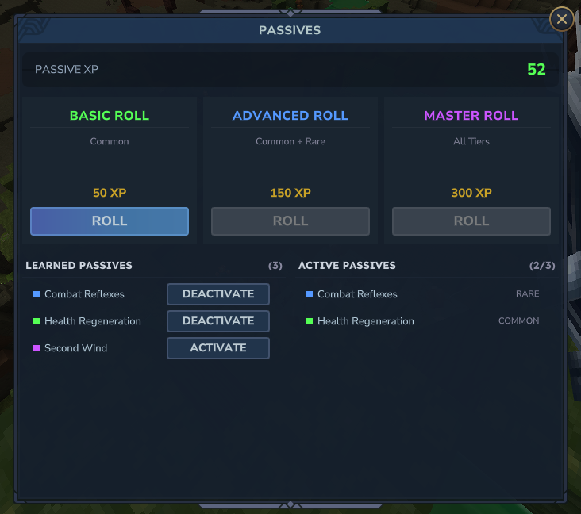

# Passives

Passives are persistent effects that activate automatically based on triggers or timed intervals. Like spells and enchantments, passives use the node-graph system.



## How Passives Work

1. Passives are activated via commands or the Passives UI
2. Each passive has a trigger type that determines when it fires
3. When the trigger fires, the passive's node graph executes
4. Players can have a limited number of active passives (default: 3)

## Tiers

| Tier | Roll Cost | Description |
|------|-----------|-------------|
| Common | 50 XP | Basic passives |
| Rare | 150 XP | Intermediate passives |
| Epic | 300 XP | Powerful passives |

Roll costs are configurable in [Configuration](configuration.md).

## Triggers

Each passive has a trigger that determines when it activates:

| Trigger | Description |
|---------|-------------|
| `on_cast` | When a spell is cast |
| `on_hit` | When a spell projectile hits a target |
| `on_kill` | When the caster kills an enemy |
| `on_damage_taken` | When the caster takes damage |
| `on_heal` | When the caster is healed |
| `on_expire` | When a spell effect expires |
| `on_interval` | On a repeating timer (uses `interval` field) |
| `on_enter_combat` | When entering combat |
| `on_exit_combat` | When leaving combat |

## Interval-Based Passives

Passives with `on_interval` trigger use the `interval` field to determine how often they fire (in seconds). For example, a mana regeneration passive with `interval: 5.0` fires every 5 seconds.

## Conditions

Passives support an optional `condition` field that restricts when the passive can activate. When set, the condition is checked before the node graph executes.

## Cooldowns

Each passive has an optional `cooldown` field (in seconds) that prevents re-activation for that duration after firing.

## Passives UI

Open the Passives UI with `/sb passives` to view and manage active passives.

## Maximum Active Passives

Players can have at most `maxActivePassives` passives active at once (default: 3, configurable in [Configuration](configuration.md)).

## Passive JSON Format

Passive definitions are stored as JSON files in the `passives/` directory:

```json
{
  "id": "mana_regen",
  "name": "Mana Regeneration",
  "trigger": "on_interval",
  "interval": 5.0,
  "cooldown": 0,
  "tier": "COMMON",
  "rollWeight": 100,
  "condition": null,
  "description": "Passively regenerates mana every 5 seconds.",
  "graph": {
    "nodes": [
      {
        "id": "node_1",
        "type": "mana_restore",
        "parameters": {
          "amount": 5
        },
        "connections": []
      }
    ]
  }
}
```

### Fields

| Field | Type | Required | Description |
|-------|------|----------|-------------|
| `id` | string | Yes | Unique passive identifier |
| `name` | string | Yes | Display name |
| `trigger` | string | Yes | Trigger type (see Triggers table) |
| `interval` | float | No | Interval in seconds for `on_interval` trigger (default: 0) |
| `cooldown` | float | No | Cooldown in seconds (default: 0) |
| `tier` | string | Yes | `COMMON`, `RARE`, or `EPIC` |
| `rollWeight` | int | No | Weight for random rolling (default: 100) |
| `condition` | string | No | Optional activation condition |
| `description` | string | No | Description text |
| `graph` | object | Yes | Node graph (same format as spells) |

## Roll Weights

When rolling for passives, the system uses weighted random selection. Higher `rollWeight` values make a passive more likely to appear. All passives of the selected tier are included in the pool.

## Commands

```
/sb passives                       # Open Passives UI
/sb passive add <id>               # Activate a passive
/sb passive remove <id>            # Deactivate a passive
/sb passive list                   # List active passives with cooldowns
/sb passive available              # List all registered passives
/sb passive all                    # Activate all available passives
```

## Creating Custom Passives

1. Create a new `.json` file in the `passives/` directory
2. Define the passive metadata (id, name, trigger, tier)
3. Set `interval` if using `on_interval` trigger
4. Optionally set a `condition` and `cooldown`
5. Build a node graph using the same node types as spells
6. Run `/sb reload` to load the new passive
