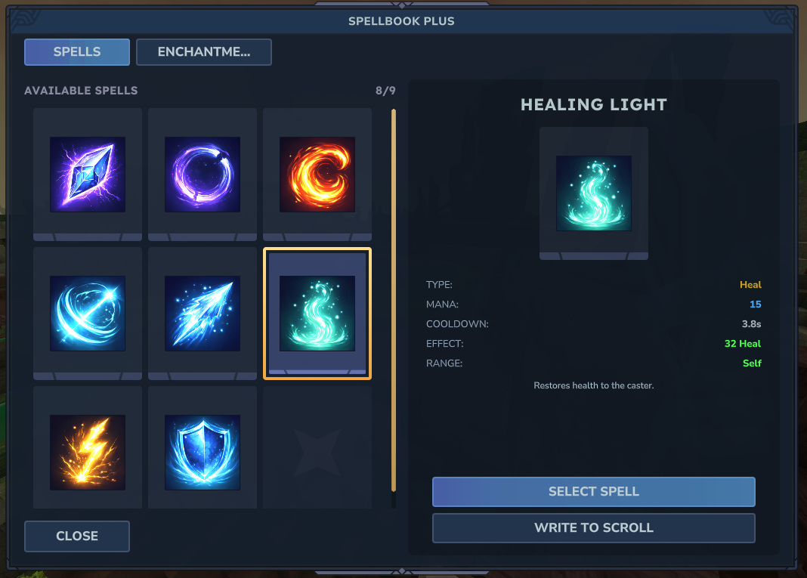

# Spells

All spells in Spellbook Plus v2 are defined using a node-graph system. Each spell is a JSON file containing a directed graph of nodes that execute in sequence.

Use the **[Spell Editor](https://spellbook-editor.hexora.io/)** to create and edit spells visually — drag and drop nodes, connect them, and export as JSON.




## Node-Graph System

A spell graph consists of:

- **Nodes** — Individual operations (deal damage, spawn projectile, heal, etc.)
- **Connections** — Links between nodes that define execution order

Each node has:

- `id` — Unique identifier within the graph
- `type` — The node type (determines behavior)
- `parameters` — Configuration for the node
- `connections` — List of node IDs to execute after this node

## Node Types

There are 22 node types in 4 categories:

### Trigger Nodes (Entry Points)

Trigger nodes start the graph execution. A spell must have at least one trigger node.

| Type | Description |
|------|-------------|
| `on_cast` | Fires when the spell is cast |
| `on_hit` | Fires when a projectile hits a target |
| `on_kill` | Fires when the caster kills a target |
| `on_damage_taken` | Fires when the caster takes damage |
| `on_heal` | Fires when the caster is healed |
| `on_expire` | Fires when a spell effect expires |
| `on_interval` | Fires on a repeating timer |
| `on_enter_combat` | Fires when entering combat |
| `on_exit_combat` | Fires when leaving combat |

### Effect Nodes

| Type | Parameters | Description |
|------|------------|-------------|
| `damage` | `amount` (int) | Deal damage to targets |
| `heal` | `amount` (int) | Restore health to the caster |
| `effect` | `effectId` (string), `duration` (float) | Apply a spell effect |
| `status_effect` | `effectId` (string), `duration` (float) | Apply a status effect with duration |

### Action Nodes

| Type | Parameters | Description |
|------|------------|-------------|
| `projectile` | `projectileId` (string), `speed` (float), `damage` (int), `impactParticle` (string) | Launch a projectile |
| `teleport` | `distance` (float) | Teleport the caster forward |
| `shield` | `amount` (int), `duration` (float) | Create a damage-absorbing barrier |
| `push` | `force` (float) | Knockback nearby targets |
| `particle` | `particleId` (string) | Spawn particle effects |
| `mana_restore` | `amount` (int) | Restore mana to the caster |

### Modifier Nodes

| Type | Parameters | Description |
|------|------------|-------------|
| `aoe` | `radius` (float) | Set area-of-effect radius for subsequent nodes |
| `glow` | `r` (int), `g` (int), `b` (int) | Set staff glow color (RGB 0-5) |
| `conditional` | `condition` (string) | Branch execution based on a condition |

## Spell JSON Format

Each spell is a JSON file in the `spells/` directory:

```json
{
  "id": "fireball",
  "name": "Fireball",
  "category": "PROJECTILE",
  "cooldown": 3,
  "manaCost": 18,
  "instability": 0,
  "description": "Launches a blazing fireball that explodes on impact.",
  "icon": "fireball.png",
  "graph": {
    "nodes": [
      {
        "id": "node_a1b2c3d4e",
        "type": "on_cast",
        "parameters": {},
        "connections": ["node_f5g6h7i8j"]
      },
      {
        "id": "node_f5g6h7i8j",
        "type": "particle",
        "parameters": {
          "particleId": "Spellbook_Fire_Cast"
        },
        "connections": ["node_k9l0m1n2o"]
      },
      {
        "id": "node_k9l0m1n2o",
        "type": "aoe",
        "parameters": {
          "radius": 4.0
        },
        "connections": ["node_p3q4r5s6t"]
      },
      {
        "id": "node_p3q4r5s6t",
        "type": "projectile",
        "parameters": {
          "projectileId": "Spellbook_Fireball",
          "speed": 25.0,
          "damage": 30,
          "impactParticle": "Explosion_Medium"
        },
        "connections": ["node_u7v8w9x0y"]
      },
      {
        "id": "node_u7v8w9x0y",
        "type": "status_effect",
        "parameters": {
          "effectId": "Spellbook_Fireball_Cast",
          "duration": 2.0
        },
        "connections": ["node_z1a2b3c4d"]
      },
      {
        "id": "node_z1a2b3c4d",
        "type": "glow",
        "parameters": {
          "r": 5,
          "g": 2,
          "b": 0
        },
        "connections": []
      }
    ]
  }
}
```

### Top-Level Fields

| Field | Type | Required | Description |
|-------|------|----------|-------------|
| `id` | string | Yes | Unique spell identifier |
| `name` | string | Yes | Display name |
| `category` | string | Yes | Spell category (see below) |
| `cooldown` | int | No | Base cooldown in seconds (default: 5) |
| `manaCost` | int | No | Base mana cost (default: 10) |
| `instability` | int | No | Base instability level (default: 0) |
| `description` | string | No | Spell description |
| `icon` | string | No | Icon filename |
| `graph` | object | Yes | Node graph definition |

## Spell Categories

| Category | ID | Description |
|----------|----|-------------|
| Projectile | `PROJECTILE` | Spells that fire projectiles |
| Damage | `DAMAGE` | Direct damage spells |
| Heal | `HEAL` | Restoration spells |
| Utility | `UTILITY` | Movement and crowd control |
| Defense | `DEFENSE` | Protective spells |
| Buff | `BUFF` | Positive effects |
| Debuff | `DEBUFF` | Negative effects |

## Built-in Spells

| Spell | ID | Category | Mana | Cooldown |
|-------|----|----------|------|----------|
| Fireball | `fireball` | PROJECTILE | 18 | 3s |
| Frost Bolt | `frost_bolt` | PROJECTILE | 15 | 4s |
| Arcane Bolt | `arcane_bolt` | PROJECTILE | 12 | 2s |
| Lightning | `lightning` | DAMAGE | 25 | 6s |
| Healing Light | `healing_light` | HEAL | 20 | 5s |
| Force Push | `force_push` | UTILITY | 15 | 4s |
| Mana Shield | `mana_shield` | DEFENSE | 30 | 10s |
| Blink | `blink` | UTILITY | 25 | 8s |

## Instability

Instability is calculated from the spell's declared instability level. When the instability system is enabled (see [Configuration](configuration.md)), high instability causes penalties:

| Level | Effect |
|-------|--------|
| Safe (0-50) | No penalty |
| Warning (50-75) | Minor effect reduction |
| Danger (75-100) | Spell may fizzle |
| Catastrophic (100+) | Spell may backfire |

All 8 built-in spells have instability level 0. Custom spells with complex graphs can set higher values.

## Checksum Validation

Each spell generates a SHA-256 checksum from its ID, name, metadata, and graph. This prevents unauthorized modification of spell files at runtime. If a checksum mismatch is detected, the spell cast fails with `CHECKSUM_MISMATCH`.

## Translations

Spells support per-locale translations. Each spell can include translation entries:

```json
{
  "translations": {
    "en-US": { "name": "Fireball", "description": "A blazing fireball" },
    "tr-TR": { "name": "Ates Topu", "description": "Alev alev bir ates topu" }
  }
}
```

The system falls back to `en-US` if a locale is not found, then to the top-level `name` field.

## Creating Custom Spells

1. Create a new `.json` file in the `spells/` directory
2. Define the spell metadata (id, name, category, cooldown, manaCost)
3. Build a node graph starting with a trigger node
4. Connect nodes in execution order
5. Run `/sb reload` to load the new spell

### Validation

All spells are validated on load using `SpellValidator.strict()`. A spell is rejected if:

- Missing `id` or `name`
- Empty graph (no nodes)
- Invalid node types
- Broken connections (referencing non-existent node IDs)
